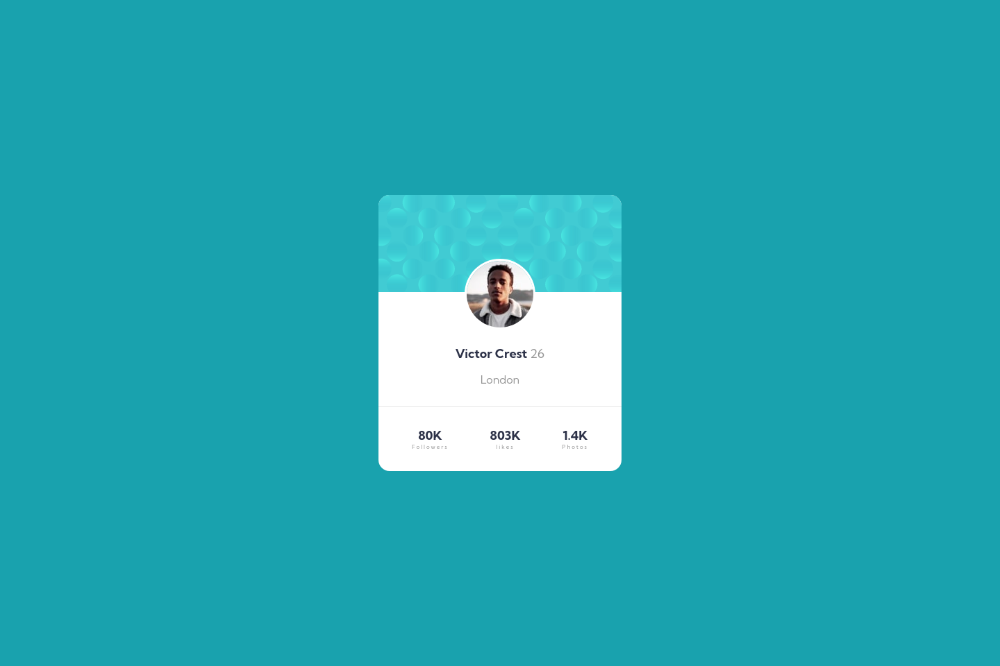

# Frontend Mentor - Profile card component solution

This is a solution to the [Profile card component challenge on Frontend Mentor](https://www.frontendmentor.io/challenges/profile-card-component-cfArpWshJ). Frontend Mentor challenges help you improve your coding skills by building realistic projects. 

## Overview

### The challenge

- Build out the project to the designs provided

### Screenshot

### Links

- Solution URL: [Add solution URL here](https://your-solution-url.com)
- Live Site URL: [Add live site URL here](https://storied-choux-77fabb.netlify.app/)

## My process

### Built with

- Semantic HTML5 markup
- CSS custom properties
- Flexbox

## Author

- Website - [Add your name here](https://www.your-site.com)
- Frontend Mentor - [@mitko90](https://www.frontendmentor.io/profile/mitko90)
- Twitter - [@DRadev90](https://www.twitter.com/dradev90)

